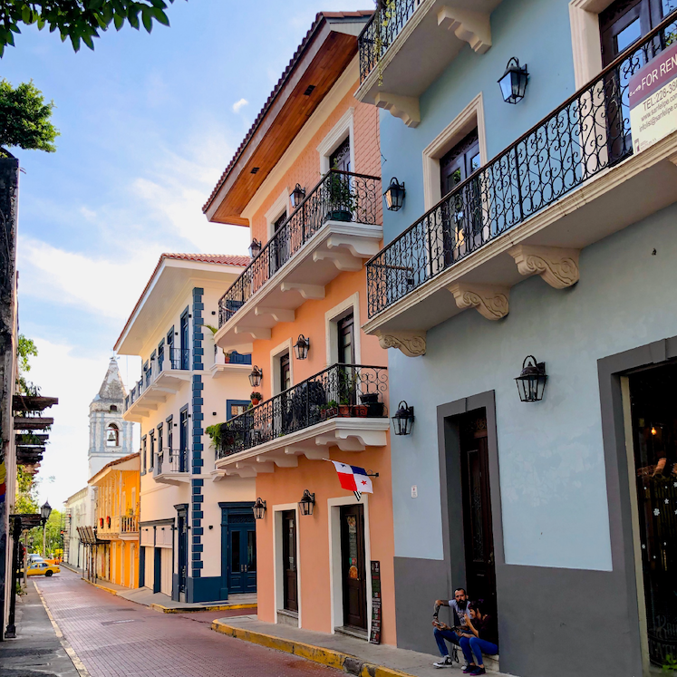
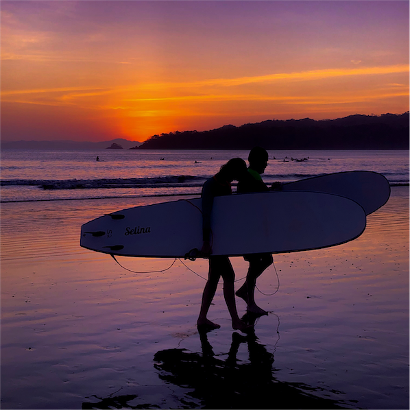
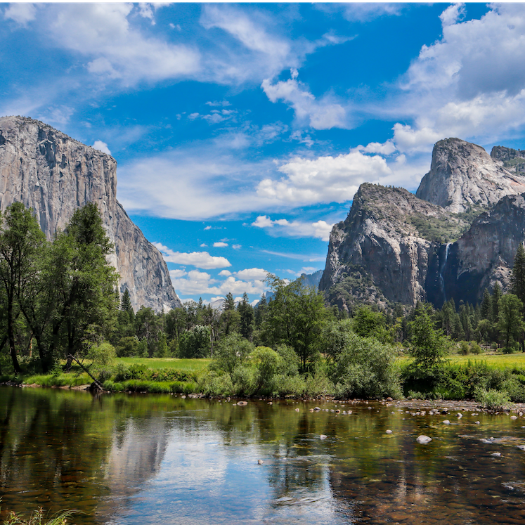

I am a PhD Student at Stanford University, part of [shape lab](http://shape.stanford.edu) and the [Stanford HCI Group](https://hci.stanford.edu/). My [research interests](research/) are primarily in the fields of Human-Computer Interaction and Accessibility. I am interested in the design of physical interfaces that leverage multimodal perception to make spatial information more accessible for people who are blind. In particular, I am interested in furthering accessibility in three application areas: design tools, collaboration tools, and information visualization. I love design and making things, and I hope my work can help empower others in the same way it inspires me.

Previously, I completed my M.S. in Mechanical Engineering also at Stanford and my B.S. in [Biomedical Engineering at Georgia Tech](https://bme.gatech.edu) with a minor in Computer Science. 

Three things I enjoy outside academics:
- my home in Panama
- the ocean
- outdoors hiking

	

		

			<figure>
				
			     <figcaption><small>Casco Viejo, Panamá, Panamá</small></figcaption>
			</figure>
		

	

	

		

			<figure>
				
			     <figcaption><small>Playa Venao, Los Santos, Panamá</small></figcaption>
			</figure>
		

	

	

		

			<figure>
				
			     <figcaption><small>Yosemite, California, USA</small></figcaption>
			</figure>
		

	

