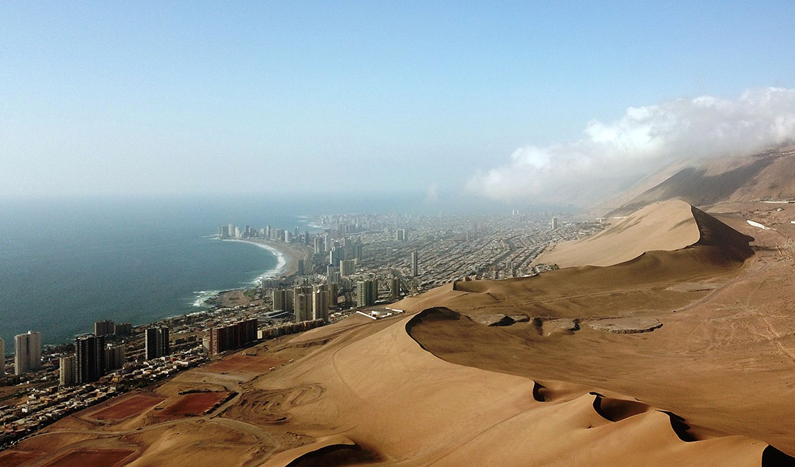
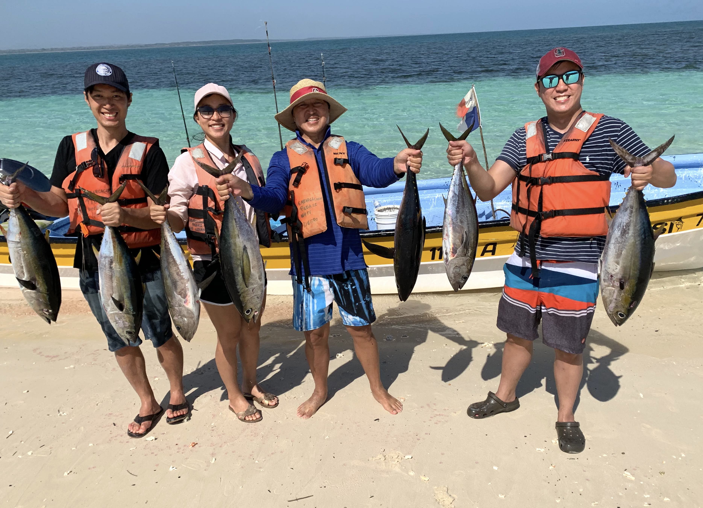

I am a PhD student at Stanford University working with Mark Cutkosky. [research](research/) how robots can use the sense of touch to execute tasks more effectively in unstructured settings such as our homes. I develop robots equipped with tactile sensing that can safely and quickly make contact with objects and leverage this contact information for grasping or exploration of objects. 

I am part of the [Biomimetric and Dexterous Manipulation Lab](http://bdml.stanford.edu/), advised by Prof. Mark Cutkosky. Prior to my PhD, I was a Robotics System Engineer at [Flexiv Robotics Inc.](https://www.flexiv.com) developing the mechatronics and controls of a 7 degrees-of-freedom torque-controlled robot arm for industrial task automation. I completed my undergraduate in Electrical Engineering and Computer Science at [UC Berkeley](https://eecs.berkeley.edu/) with a focus in mechatronics and signals and systems.

I'm originally from Chile, from a small city in the north called Iquique (I've been told it looks like Tatooine). Outside of work I like to spend my free time going on fishing trips, baking bread and getting some fresh air on a hiking trail..

	

		

			<figure>
				
			     <figcaption><small>Dunas de Cerro Dragon, Iquique, Chile</small></figcaption>
			</figure>
		

	

	

		

			<figure>
				
			     <figcaption><small>Pedasí, Los Santos, Panamá</small></figcaption>
			</figure>
		

	

