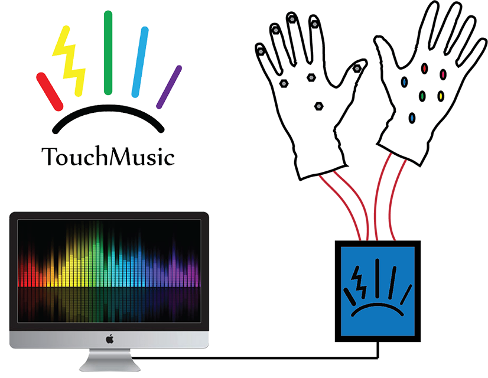
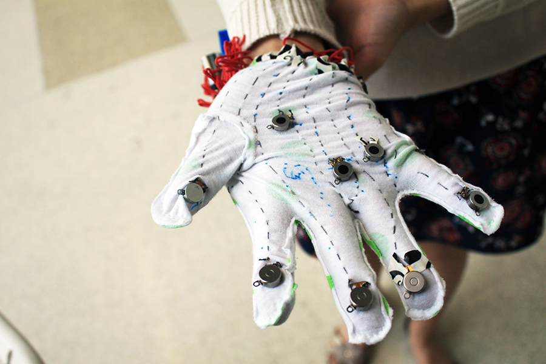
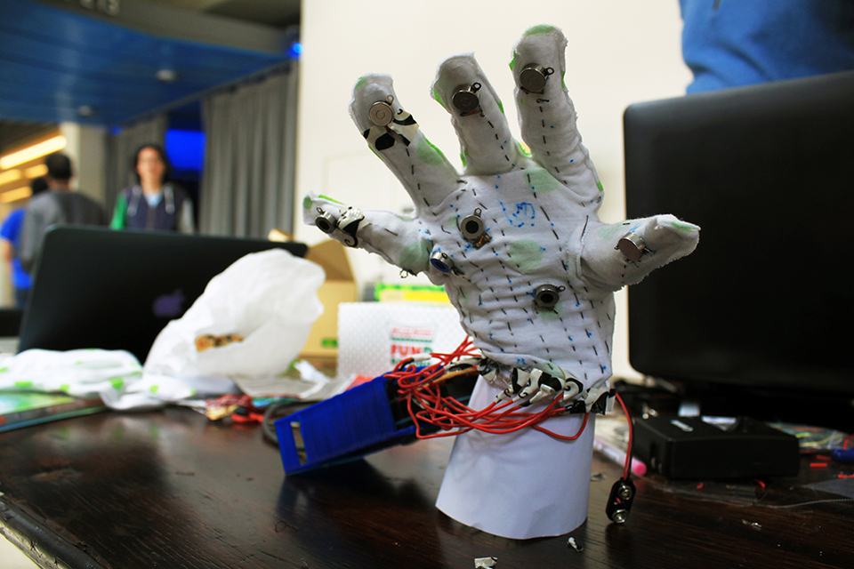
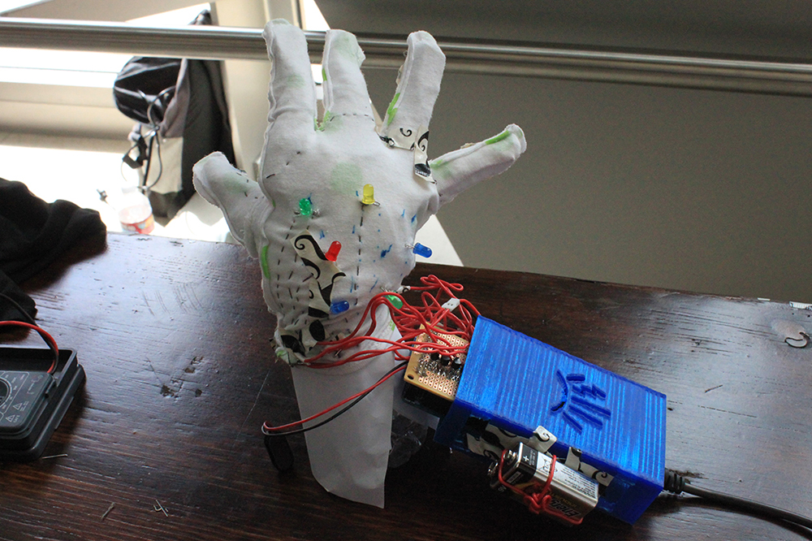

- Team Members: Alexa F. Siu, Michael Lin, Kenneth Lin, Kevin Chen
- Institutions: Georgia Institute of Technology, University of California Berkeley
- [Challenge Post](http://challengepost.com/software/jammed)
- [Github repository](https://github.com/linkenneth/feelbrations)

The TouchMusic glove is a wearable gadget that enables a music lover to physically experience their favorite songs. The glove does this by decoding a song's rhythm and melody to construct patterns to vibrate into the hand. These palpable patterns will match the audible music for a synergistic, pleasurable sensation.

The software component (written in Python) first decodes the song into different bands of frequencies. After analyzing the bands with Fast Fourier Transform (FFT), it creates a sequence of vibrations that matches the song's rhythm and melody. The sequence of vibrations is then serialized and sent to the micro-controller for the glove. Sewn with conductive thread, the glove has vibration motors and LEDs that are driven by the micro-controller.

<figure>
  
  <figcaption></figcaption>
</figure>

<figure>
  
  <figcaption></figcaption>
</figure>

<figure>
  
  <figcaption></figcaption>
</figure>

<figure>
  
  <figcaption></figcaption>
</figure>

I traveled a long way for this hackathon but the experience was very worth it! Approaching my undergraduate graduation, this hackathon made me realize there was a thing or two I had learned through my undergraduate courses. This project brought to light my experience/knowledge in different domains from CAD, electrical and mechanical design, to more theoretical concepts such as signal processing and programming.
